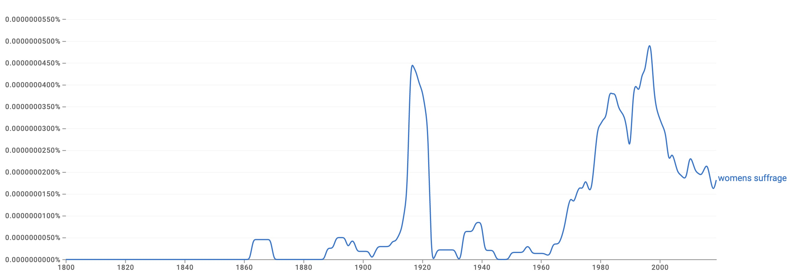

# Assignment 4

## Running

Create unigram and bigram distributions from source text:
- `python3 prog1.py -f <language_file>`

You can specify many different languages to create distributions for simultaneously:
- `python3 prog1.py -f <language_file_1> -f <language_file_2> [...]`

All distributions will be saved in the `dists/` folder.

Run inference on test set:
- `python3 prog2.py -d dists/ -t ./data/LangId.test -l ./data/LangId.sol`

## Narrative

N-grams are a sliding window across a body of text, used in NLP to represent sequences of $n$ consecutive tokens within a text. Depending on the modeling approach, a token can either be a character or a word, or in some cases even a punctuation point. By analyzing these n-grams, language models can predict what words are likely to follow one another, which can be useful in a variety of applications.

The obvious applications of an n-gram based language model relate to text prediction and completion, such as those used in search engines (Google) or mobile keyboards (Gboard, SwiftKey). Some non-obvious uses of n-grams includ machine translation (have n-gram pairs from a source to target language), spam filtering (score n-grams by their "spamminess" and compute an aggregate score for an email), or sentiment analysis (determine positive/negative n-grams in a text). 

To create such a language model, the source text must be first tokenized, and n-grams created from the tokens. To compute a raw probability, we compute the count divided by the number of unigrams. This is smoothed to handle the case of every n-gram not being in our frequency distribution by various types of smoothing. For example, LaPlace smoothing adds 1 to the count and adds the vocabulary size to the number of unigrams. For bigrams, we use the frequency of the first word in the bigram as the denominator.

Like any other model, the input corpus used to build it is very important. It determines the vocabulary and distribution of words and phrases in the model. It's important for the corpus to match the style of the text used for inference. Different types of texts may require different language models, such as news articles versus social media posts.

Before using an n-gram based language model for inference, we must address the issue of zero probabilities for n-grams that don't appear in the training data. An approach known as *smoothing* provides a solution to that, in which a probability distribution with zero values is filled with a bit of probability mass. One of the simplest approaches to smoothing is to add a small constant to the frequency of each n-gram to avoid zero probabilities.

Once the model is built, inference is fairly simple. Simply predict the most likely word or sequence of words to follow the given input. However, this is prone to repetitive and nonsensical output, and does not account for context or intent. Additionally, the output of such a LM would be relatively boring given the same inputs due to the lack of randomness in selecting the next n-gram.

Some evaluation metrics for language models such as this one include human review, where human annotators check the performance of the model. Alternatively, an intrinsic, automated metric such as perplexity, provides a more objective metric for LM evaluation. Perplexity is the inverse probability of seeing the words we do, normalized by the number of words. A low perplexity is considered ideal.

The Google n-gram viewer is a web-based tool that allows users to search and visualize the n-grams in a large corpus of books digitized by Google. It allows users to search for and compare the frequency of different n-grams across a specific time period or language. The viewer can be used for linguistic analysis, historical research, and to explore cultural trends and changes over time. For example, let's compare the relative frequency of the ngram "womens suffrage" over the period of 1800 to 2019:

We can see that this particular phrase spiked in popularity within literature in 1916, likely due to the run-up and aftermath of a large push for women's suffrage around this time. A similar spike occurred in 1996, around the 75th anniversary of this movement.