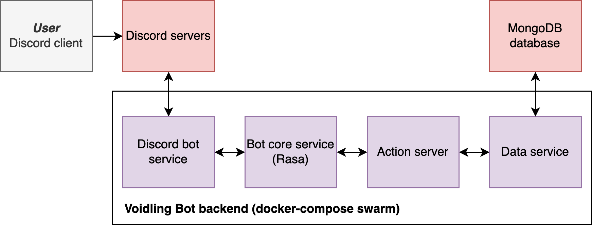
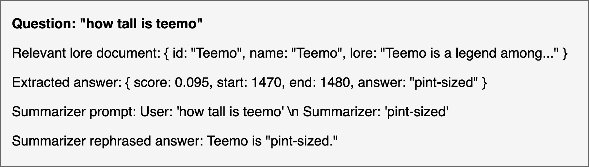
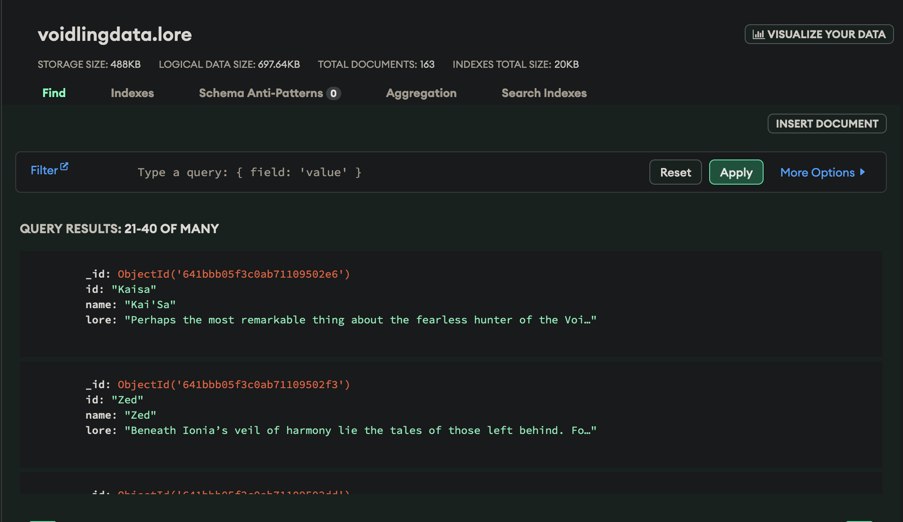
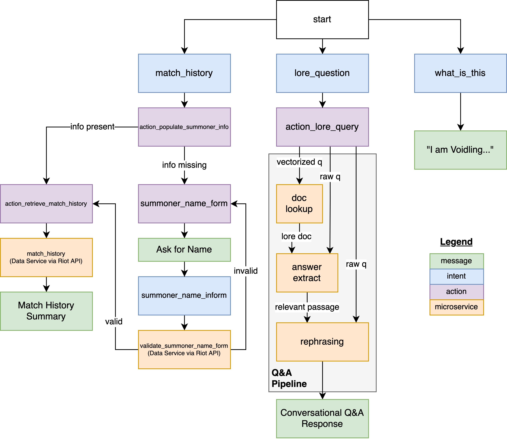
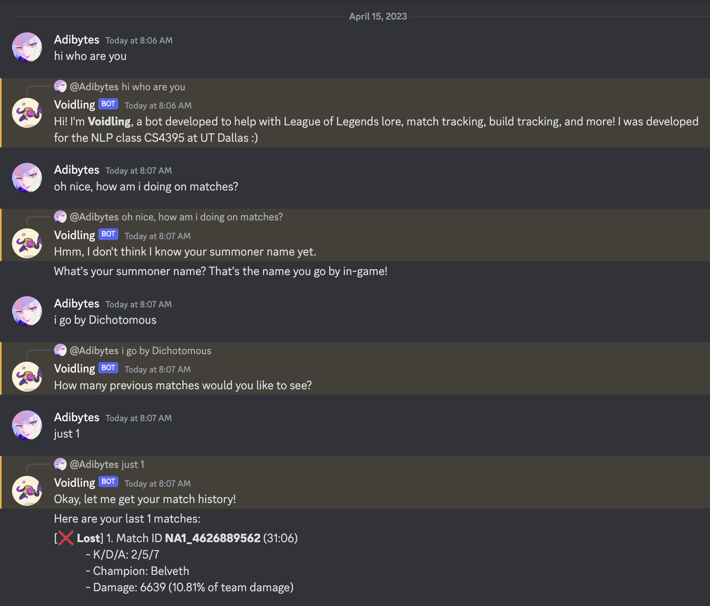
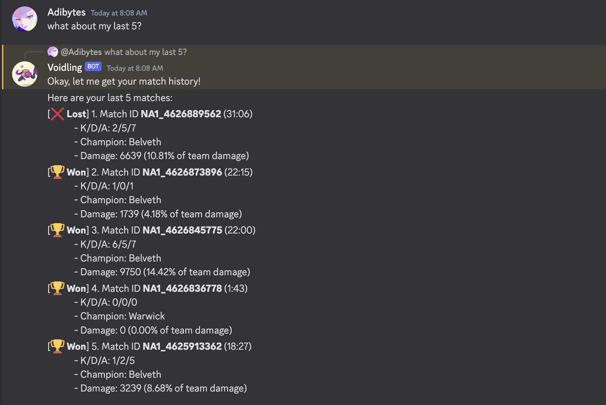
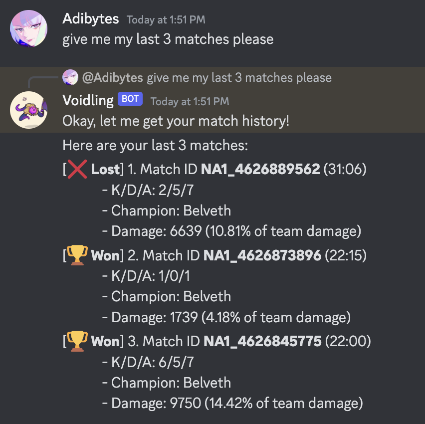
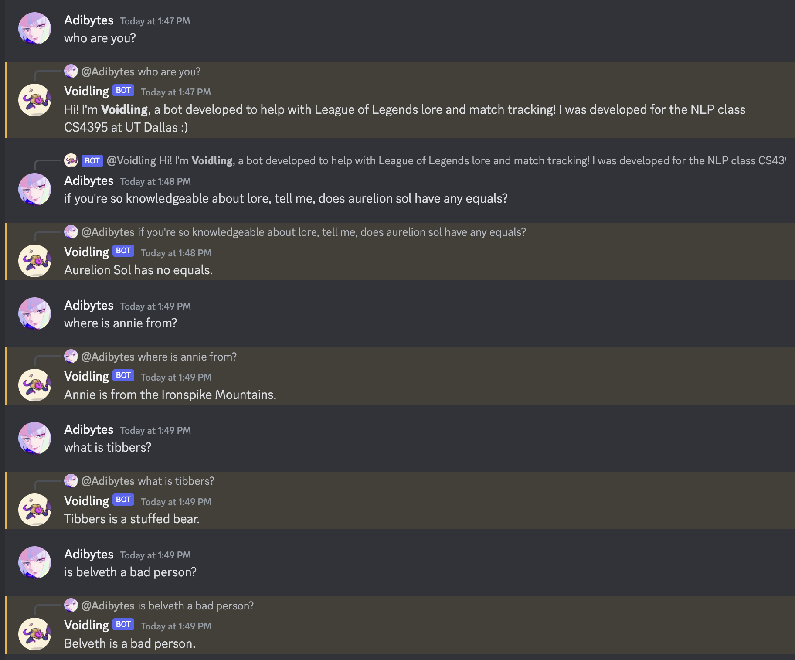
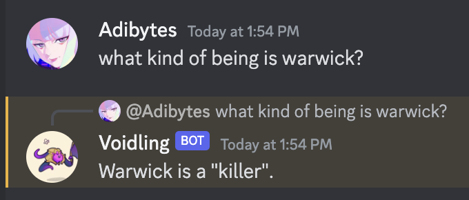
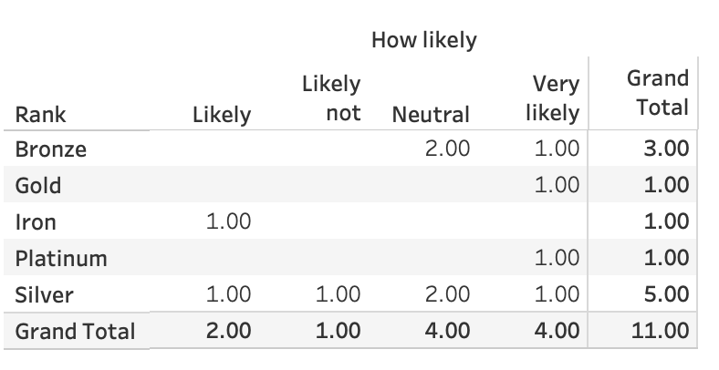

# Project: Voidling - A Chatbot for League of Legends Players

**Note**: This part of the repository only contains code and supporting assets for the project report.

All code for Voidling can be found in its [own dedicated repo](https://github.com/adityarathod/voidling).

## Introduction

League of Legends (LoL) is a multiplayer online battle arena game, widely considered one of the most-played games of all time (8 million daily active users) [@legorigin]. Due to its multiplayer nature, League (as it is called in short) players often seek out tools to track and improve their gameplay in order to secure a competitive advantage. League also has an extensive library of lore and backstory behind every playable character ("champion," as they are called in LoL terms) in the game. The shared universe that each champion exists in contributes to its gameplay fantasies and interactions in-game.

As a casual player of the game, I wanted to build a centralized tool to answer questions about the game's lore and regarding game-specific performance metrics. <!--techniques such as builds, match win/loss history, champion counters, and jungle pathing.-->

In this paper, I present Voidling, a Discord-based bot that achieves all these goals while leveraging techniques learned within this class. 

## System Architecture
Voidling relies on a *microservice-based* architecture, in which functionality is encapsualated within smaller functional units that run independently of one another and use HTTP-based RPC calls to perform actions and transfer data. Figure 1 provides a high-level overview of the bot.




To simplify deployment, all microservices are containerized via Docker and orchastrated using `docker-compose`.

Breaking down each service in detail:

### Discord Bot Service
Written in `discord.py`, it serves as a bot client to the Discord messaging platform. It allows us to listen for messages, process them in the bot core (via HTTP `POST` requests), and send the resulting output back to Discord. This is a fairly naive component of the system, solely serving as a I/O connector.

### Bot Core Service
Based on the chatbot framework Rasa, it serves as the core of the bot, extracting entities and classifying intents, and calling the appropriate services to make things happen. Exposed to the bot service via a simple REST endpoint.

Rasa processes input as follows:

1. **NLU Pipeline**: Tokenization, featurization, intent classification, and entity extraction occurs at the base level, using a mix of heuristics and neural network-based methods.
2. **Next-Action Prediction**: Using rules (which are hard-coded action sequences) and stories (probabilistic/ML-based action sequences), the engine predicts the next action to take based on the detected intent and entity, taking into context the previous intents and entities. This allows the bot to do things like loop until all values in a form are provided by the user.
3. **Action Dispatching**: In some cases, custom actions need to be dispatched by the bot core – either manually specified as part of a rule or inferred as a validation action for a form. A component of Rasa performs these actions via HTTP to the action server (described below).

This is a pretty heavy component and can probably do a lot more, but I relied on my own code for any functionality not described in the pipeline above.

### Action Server
An intermediary REST-based service that is compliant with the Rasa Action Server protocol. This component holds custom logic to populate "slots" (localized user profile information) based on previous conversations with the bot (retrieved from the data service). It also holds validation logic, as well as dispatching logic for the Q&A pipeline (described below).

### Data Service
The Sanic-based API server that serves as the brains of the entire bot, and the most intensive and complex part of the bot architecture. The data service serves as a unified interface for retrieval and persistence of champion lore as well as user profiles. It is also home to a fairly novel and advanced hybrid extractive/abstractive question answering pipeline used in the bot. Additionally, it holds scraping logic for the bot's various data sources.

#### Database Persistence
The persistence method used by the Data Service is an AWS-hosted MongoDB Atlas cluster. This was chosen for its flexibility and relatively lightweight nature.

#### Champion Lore Q&A Pipeline
The most advanced part of the data service is the lore Q&A pipeline, which utilizes IR techniques learned in class.

Lore from the League of Legends website [(link)](https://universe.leagueoflegends.com/en_US/) is vectorized via TF-IDF, then reduced into low-rank vectors (dim = 163) using the `TruncatedSVD` algorithm using a `scikit-learn` pipeline. This produces a matrix of vectors, one vector per lore document. To retrieve the relevant document for a question, it is vectorized and ranked using cosine similarity with every document vector. The appropriate document is fetched from the database and passed to the second step of the pipeline.

The second part of the pipeline focuses on producing an answer to the question based on the lore document. Utilizing a small version of the DistilBERT model finetuned on the SQuAD reading-comprehension dataset, the pipeline is able to produce a short passage of text that likely represents the answer to the user's question.

However, since a simple extractive answer isn't conducive to a conversational setting, I took a creative approach to answer rephrasing without having to resort to LLMs or rule-based NLP techniques. I actually repurposed a small language model that was finetuned on a dialogue summarization dataset to rephrase answers. With some clever rephrasing of the question/extractive answer pair as a conversation between the "User" and "Summarizer," I was able to produce coherent outputs most of the time. The clear limitation is when the answer is wrong or completely inconsistent in language with the question. An example of the Q&A pipeline output can be seen in Figure 2.




#### Champion Lore Scraper
In order for the Q&A pipeline to work, we must collect lore to train models on. This was developed as a simple web scraper at first but evolved into a slightly more advanced consumer of Riot Games APIs to reliably collect information about every champion (playable character) in the game.

Each champion's name and internal ID was collected off the League of Legends Data Dragon API [(link)](https://developer.riotgames.com/docs/lol#data-dragon) and then was used to scrape the League of Legends Universe site. Each champion's biography was then saved locally (for developing Q&A pipeline functionality) and persisted into the database for later retrieval.

Brief examples of the lore stored and the associated schemas can be seen in Figure 3.




#### User Profile Persistence
Using the MongoDB backend, we store mappings between Discord users and their in-game names/identifiers for future use. This enables better UX on the client side when querying for their match histories.

A full sample of the user model can be viewed in [Appendix B](#appendixb).

#### Riot Games Summoner and Match API Integration
In order to support match history querying, I applied for integration with Riot Games APIs. This would allow the bot's user profiles to be useful for a bot-level task, as in-game names would need to be resolved into internal identifiers used by the APIs. This lookup is actually done at the user's first interaction with the bot after they're asked for their summoner name, as it's validated against the API and then persisted alongside their Discord account ID to provide a persistent mapping of the two.

The data service then uses this identifier to pull the user's most recent matches and get details regarding them.


## Dialogue Tree
The dialogue tree is visualized in Figure 4 below.



## Sample Interactions


#### Match History (new user with no profile)





Notice how the bot picks up context from the first request to help with the second one.


#### Match History (existing user)

To demonstrate the persistence aspect of the bot, I have returned to it after many hours, and I request a match history report from it. Figure 7 shows how it doesn't ask me about my summoner name because it's already associated it with my Discord user ID.




#### Lore Queries



This Q&A pipeline doesn't always work well for questions that require any additional logical reasoning, as demonstrated in Figure 9.




## Evaluations
Evaluations of the bot were performed as a random sample of UTD League of Legends players that were solicited for this study. While this isn't a perfect sampling method, it was used simply in the interest of saving time.

Respondents were shown the feature set of the bot and were asked, "How likely would you use Voidling for learning more about League of Legends lore?"




## Appendix A: Knowledge Base Samples
Extracted from MongoDB database. Riot Games holds the copyright to these stories.

### Jinx

```json
{"_id":{"$oid":"641bbb05f3c0ab71109502ee"},"id":"Jinx","name":"Jinx","lore":"<see below>"}
```

#### Lore
While most look at Jinx and see only a mad woman wielding an array of dangerous weapons, a few remember her as a relatively innocent girl from Zaun—a tinkerer with big ideas who never quite fit in. No one knows for certain what happened to turn that sweet young child into a wildcard, infamous for her wanton acts of destruction. But once Jinx exploded onto the scene in Piltover, her unique talent for sowing anarchy instantly became the stuff of legend.

Jinx first gained notoriety through her anonymous “pranks” on the citizens of Piltover… particularly those with connections to the wealthy merchant clans. These pranks ranged from the moderately annoying to the criminally dangerous. She blocked streets on Progress Day, with a stampede of exotic animals freed from Count Mei’s menagerie. She disrupted trade for weeks when she lined the city’s iconic bridges with adorably destructive flame chompers. Once, she even managed to move every street sign in town to new and utterly confusing locations.

Though this unknown troublemaker’s targets seemed random, and her motivation nothing more than pure chaos, her actions always served to bring the city’s orderly bustle to a screeching halt.

Naturally, the wardens attributed some of her crimes to chem-punk gangs from the undercity. Having others get credit for her manic schemes didn’t sit well with Jinx, and so she made sure to make her presence known at every future crime scene. Rumors soon circulated of the mysterious, blue-haired Zaunite girl carrying chemtech explosives, a shark-mouthed rocket launcher, and a repeater gun. Still, the authorities dismissed these reports as preposterous. After all, how could a lowly street punk possibly obtain such lethal ordnance?

Jinx’s bombastic spree seemed endless, with the wardens’ attempts to catch the culprit thwarted at every turn. She began tagging her works of destruction with vivid graffiti, and other taunting messages directed at the city sheriff’s newest ally in the fight against crime, Enforcer Vi.

Jinx’s reputation grew, leaving the people of Zaun divided as to whether she was a hero for sticking it to the arrogant Pilties, or a dangerous lunatic for escalating existing tensions between their two cities.

After months of ever-increasing carnage, Jinx unveiled her biggest plan yet. In her trademark electric pink, Jinx daubed the walls of the Ecliptic Vaults—one of Piltover’s most secure treasuries—with a very unflattering caricature of Enforcer Vi, and the details of her own intention to rob the stores within.

An uneasy sense of anticipation settled on Piltover and Zaun leading up to the promised date of the heist. Many doubted even Jinx would have the guts to show up and risk almost certain capture.

When the day arrived, Vi, Sheriff Caitlyn, and the wardens prepared a trap for Jinx outside the treasury. But Jinx had already smuggled herself inside by way of an oversized coin crate that had been delivered days before. When Vi heard pandemonium erupt from inside the structure, she knew the wardens had been outclassed once again. She burst into the treasury, and the ensuing confrontation left the Ecliptic Vaults a smoldering ruin, and the merry mischief maker Jinx nowhere to be found.

Jinx remains at large to this day, and is a constant thorn in Piltover’s side. Her schemes have inspired copycat crimes among the chem-punks, as well as numerous satirical plays lampooning the incompetence of the wardens, and even a smattering of new colloquialisms throughout both cities—though no one has yet had the courage to call Enforcer Vi “Pretty-in-Pink” to her face.

Jinx’s ultimate endgame, and her obvious obsession with Vi, both remain a mystery, but one thing is certain: her crimes are continuing and growing in sheer audacity

### Bel'Veth
```json
{"_id":{"$oid":"641bbb05f3c0ab71109502e7"},"id":"Belveth","name":"Bel’Veth","lore":"<see below>"}
```

#### Lore

Fascinated by the world of existence and eager to create one for herself, Bel’Veth is like a dark cancer that has metastasized within the heart of the Void, through which all of Runeterra will be consumed and rebuilt in her own twisted image. She hungers for new experiences, memories, and concepts in vast amounts, devouring whole cities and their populations before repurposing the information into a sprawling alien landscape known as the Lavender Sea. Yet even the Void is not safe from her voracity as she spreads within it like a primordial ocean, forcing all before her to submit to her world of want... or be destroyed.

Though Bel’Veth is new to Runeterra, her birth is untold millennia in the making—the end result of an allergic reaction between the Void and a nascent reality. The once-pristine dimension of peaceful nothingness was irrevocably shattered when existence came into being, and forcefully individualized Void entities lashed out for eons in an attempt to defend themselves from the shock and pain. Erasing everything they consumed, they were named by virtue of what they left behind—a void. But the beings within were changed each time they touched the world, mutating from their once-perfect forms into hedonistic, violent animals.

So too did the Void change with them. After every battle, every incursion, something more sinister grew deep within a hidden womb inside the darkest recesses of the Voidborn tunnels... Buildings, sunlight, proto-humanoid limbs reaching toward nothing... A jigsaw puzzle where none of the pieces fit... The Void had taken a new, hideous shape. In time, fueled both by humans opening rifts for war and the Watchers attempting to invade the Freljord, this blasphemous pocket of un-creation grew to embrace the opposites of the Old Void: desire, want, and need.

Soon enough, it craved a leader. Someone—or something—who could write a horrific new chapter in the worlds above and below. A leader who could interface with these “humans,” tell them of what was to come, and harvest their emotions and memories as they fought a bitter, fruitless war until the last fires of civilization died and a new era spawned.

This leader is Bel’Veth. A terrifying empress born from the combined memories, experiences, and emotions of an entire devoured port city and its outlying ocean—Bel’Veth’s mind contains millions of years of perfectly preserved knowledge, giving her near-omniscience as she prepares to destroy both Runeterra and the domain of her progenitors, the Watchers.

To those lucky enough to be of strategic value to her, she does not lie, ask questions, nor obfuscate the truth—she simply states the nature of things, for with victory all but assured thanks to the very nature of the Void itself, there is no need to say anything more. And to those who displease her, they will find her human form to be merely adaptational—nerve endings, muscles, and eyestalks—as she unfurls her titanic wings to reveal her true, monstrous figure.

Ironically, the ancient Shurimans had a word for such a concept. Loosely translated to “God of Oblivion,” it was a tribal myth of a remorseless deity who would erase all things without hatred, replacing them with itself. They named the city of Belveth after it, though the true meaning was lost after many hundreds of years.

Lost to all, perhaps, save for the creature that city has become.

## Appendix B: User Model Samples
Extracted from MongoDB database. Most identifiers are unique to their respective platforms. While these have no direct meaning as stored, they help us extract relevant, personalized info from the Riot Games API. In a sense, these user models are "live lookup keys" for the knowledge base that is each player's game data.

```json
{
  "_id": {
    "$oid":"643a64e27a01a8f2c8356b6f"
  },
  "discord_id":"342428858596982784",
  "name":"Dichotomous",
  "puuid":"15MA333iAB2Tey-gAjcCPwo3QV0DIOPsNVpA7CDt94APQ_r_h0qh_gxO9pg7eHXy3zCSUnE_6aMedQ",
  "summoner_level": 143
}
```

## References

See [report.bib](./citations/report.bib).